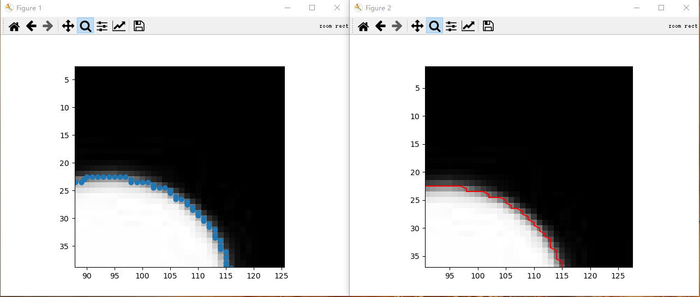

# Marching Squares
Simple python implementation of Marching Squares Algorithm.


# Quick Start

```bash
python main.py # run demo
```




# Usage

```python
import MarchingSquares

data = ... # numpy array, 2-dimention, single channel, range [0,1]
points = MarchingSquares.Extract(data, level=0.5) # we got contour points
```


# Requirement

numpy >= 1.19.4

if you want to run the demo,

pillow >= 8.0.1

matplotlib >= 3.3.3


# References

https://en.wikipedia.org/wiki/Marching_squares
